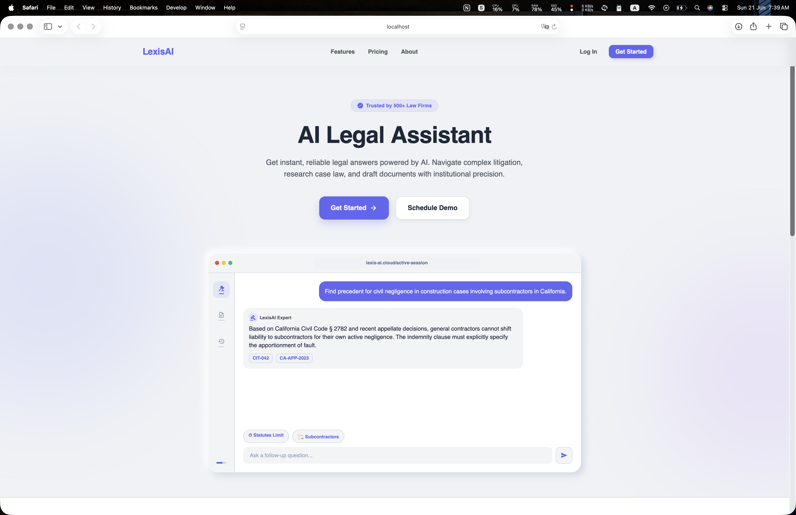
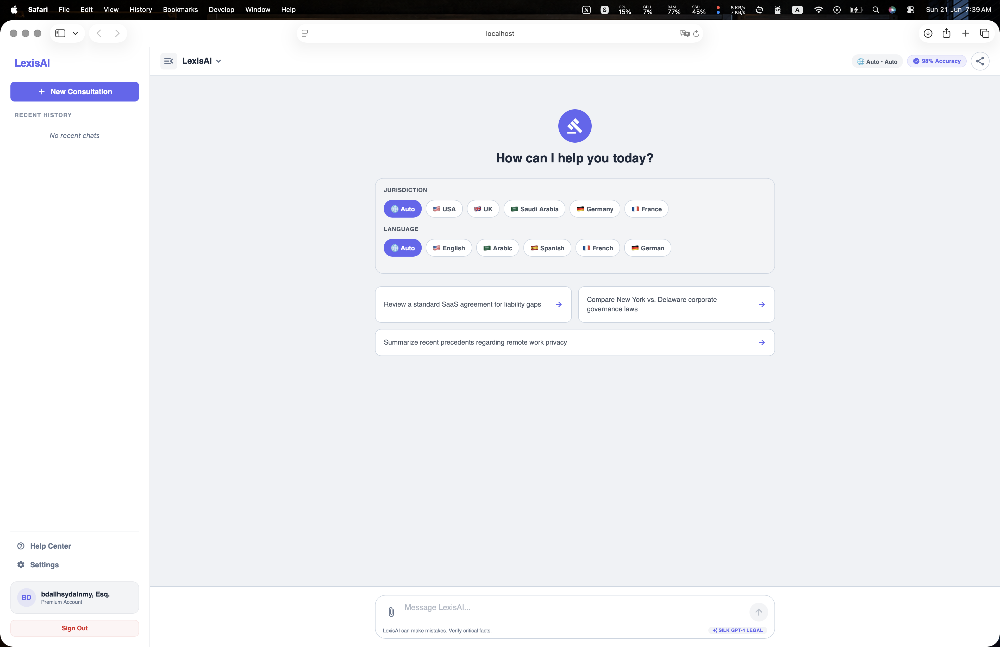
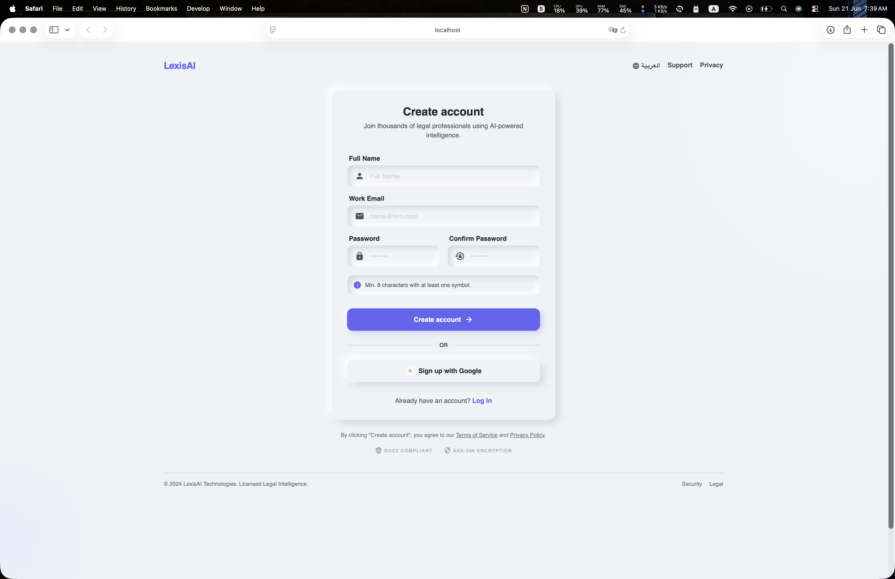

# LexisAI: Enterprise-Grade AI Legal Assistant

LexisAI is a professional-grade, cross-border, AI-powered Legal Assistant tailored for modern legal practitioners. It features a cross-platform mobile and web application built on **Expo (React Native)**, a high-performance **FastAPI** backend acting as a distributed Legal AI Gateway, a relational **PostgreSQL** database, **Redis** caching, and Google Gemini LLM integration for legal analysis.

The system includes a dedicated boilerplate pipeline for **AI Model Fine-Tuning** to train models on custom jurisdiction case files or contracts.

---

## User Interface Preview

### 1. Landing & Welcome Portal
The landing screen provides a premium, modern introduction to the legal assistant, highlighting core features, dynamic CTA navigation, and sample query previews.

<p align="center">
  
</p>

### 2. Legal Consultation Dashboard
The core interface features a clean multi-panel chat workspace with jurisdiction filtering (e.g., USA, Saudi Arabia, Nigeria, Egypt), language localization switches (English / Arabic RTL), quick prompt suggestions, and a persistent side history menu.

<p align="center">
  
</p>

### 3. Secure Authentication Flow
Minimalist, high-fidelity auth panels supporting traditional credentials and secure OAuth (Google/GitHub integrations) with intuitive translation selectors.

<p align="center">
  
  
</p>

---

## Architecture & Technology Stack

### Key Technologies
* **Frontend**: Expo (React Native, TypeScript), React Native Web, Metro Runtime, Babel. Supports iOS, Android, and Web browsers.
* **Backend**: FastAPI (Python 3.11+), SQLAlchemy ORM, Pydantic v2, WebSockets.
* **Database & Cache**: PostgreSQL (Relational storage for users, chats, and messages), Redis (Session token cache).
* **AI Core**: Google Gemini API for legal analysis, query resolution, and document extraction.
* **Containerization**: Docker, Docker Compose.

---

## Key Features

1. **Dual-Language & RTL Layout (English / Arabic)**:
   * Dynamically switches theme and text-direction (`ltr` / `rtl`).
   * Complete dictionary translations in `LanguageContext.tsx`.
2. **Context-Aware Jurisdiction Filters**:
   * Tailor AI legal answers to specific countries (e.g., USA, Saudi Arabia, Nigeria, Egypt).
   * Prompts enforce that the AI acts as an assistant and reminds users that responses are for general information rather than official advice.
3. **Dual Transport Protocol**:
   * Standard REST endpoints for quick queries.
   * Bidirectional real-time **WebSockets** connection (`/gateway/ws`) for interactive chat streams.
4. **Auto-Session Naming**:
   * Automatically renames default session titles ("New Chat") dynamically based on the user's first query context.
5. **Secure Authentication**:
   * Standardized JWT access and refresh token authentication flows with secure password hashing via `bcrypt`.
6. **Docker-Orchestrated Local Startup**:
   * Shell script validates Docker status and initializes all containers automatically.

---

## Project Directory Structure

```text
├── backend/
│   ├── app/
│   │   ├── core/              # DB connections, Redis setup, configuration environments
│   │   ├── models/            # SQLAlchemy database model classes (user.py, chat.py)
│   │   ├── repositories/      # Database access layers (ChatRepository, UserRepository)
│   │   ├── routers/           # FastAPI routers (auth, users, chat)
│   │   ├── schemas/           # Pydantic validation schemas
│   │   ├── services/          # Business logic & Google Gemini integration (chat.py)
│   │   └── main.py            # App initialization, CORS, exception handlers
│   ├── .env.example           # Reference environment configurations
│   ├── Dockerfile             # Multi-stage Python build
│   ├── requirements.txt       # Python package dependencies list
│   ├── schema.dbml            # Database Markup Language specification
│   └── schema.png             # Visual database schema diagram
│
├── frontend/
│   ├── src/
│   │   ├── components/        # Reusable UI elements (PremiumButton, PremiumInput)
│   │   ├── context/           # ThemeContext (Light/Dark), LanguageContext (EN/AR, RTL)
│   │   ├── screens/           # Main Screens (Welcome, Login, SignUp, Dashboard)
│   │   └── services/          # apiService (REST/WS calls, JWT Token storage & refresh)
│   ├── App.tsx                # Client app entrypoint & navigation router
│   ├── Dockerfile             # Production Expo/Metro build config
│   └── package.json           # Frontend dependency manifest
│
├── model_finetune/            # Local pipeline boilerplate to fine-tune AI models
│   ├── configs/               # YAML hyperparameter configurations
│   ├── data/                  # Workspace for JSON dataset assets
│   ├── src/                   # PyTorch dataset loaders, models, and trainers
│   ├── workflow.ipynb         # Interactive Jupyter research workflow
│   └── README.md              # Fine-tuning process guidelines
│
├── docker-compose.yml         # Dev/Prod multi-container setup
├── run.sh                     # Automated initialization and startup script
└── LICENSE                    # MIT License specification
```

---

## Environment Configurations

### Backend Settings (`backend/.env`)
Create a `.env` file in the `/backend` folder matching the `.env.example` schema:

| Variable | Description | Default / Example |
| :--- | :--- | :--- |
| `PROJECT_NAME` | Project name displayed on FastAPI Swagger | `Legal AI Gateway` |
| `DATABASE_URL` | PostgreSQL connection string | `postgresql://postgres:postgres@db:5432/legal_ai` |
| `REDIS_URL` | Redis instance connection string | `redis://redis:6379/0` |
| `JWT_SECRET_KEY` | HS256 secret key for signing access tokens | *Change to a strong random key* |
| `JWT_REFRESH_SECRET_KEY` | HS256 secret key for refresh tokens | *Change to a strong random key* |
| `ACCESS_TOKEN_EXPIRE_MINUTES` | Lifetime of an access token | `30` |
| `REFRESH_TOKEN_EXPIRE_DAYS` | Lifetime of a refresh token | `7` |

### Frontend Settings (`frontend/`)
The frontend environment variables are loaded inside `App.tsx` and `src/services/api.ts` via Expo public settings. In docker environments, these are injected via `docker-compose.yml`:
* `EXPO_PUBLIC_API_URL`: Points to the HTTP backend server (e.g., `http://localhost:8000`).
* `EXPO_PUBLIC_WS_URL`: Points to the WebSocket backend socket (e.g., `ws://localhost:8000`).

---

## Quickstart & Local Setup

### Prerequisites
* **Docker & Docker Compose** installed and running on your system.
* A valid Google **Gemini API Key** configured in your environment settings (`backend/.env`).

### Startup
We provide an interactive script `run.sh` at the root directory which handles safety checks, stops conflicts, and starts containers:

1. Ensure the script is executable:
   ```bash
   chmod +x run.sh
   ```
2. Launch the script:
   ```bash
   ./run.sh
   ```
   The script will:
   * Verify Docker is active.
   * Gracefully stop and clean up stale containers from previous executions to avoid port conflicts.
   * Run `docker compose up --build` to launch PostgreSQL, Redis, FastAPI, and the Expo Frontend.

---

## Services Overview

Once all services are running successfully:

* **Frontend Client (Expo)**: Accessible on [http://localhost:3000](http://localhost:3000).
* **Backend API Documentation (Swagger UI)**: Accessible on [http://localhost:8000/docs](http://localhost:8000/docs).
* **Backend API Server**: Runs on [http://localhost:8000](http://localhost:8000).
* **PostgreSQL Database**: Accessible on port `5432`.
* **Redis Cache**: Accessible on port `6379`.

---

## Main REST API Endpoints

Below is a breakdown of the key endpoints exposed by the **FastAPI Legal AI Gateway**:

### Authentication Router (`/auth`)
* `POST /auth/signup` - Registers a new user.
* `POST /auth/login` - Authenticates credentials and returns access & refresh tokens.
* `POST /auth/refresh` - Issues a fresh access token using a valid refresh token.

### User Router (`/users`)
* `GET /users/me` - Retrieves the authenticated user profile details.

### Chat Router (`/session` & `/chat` & `/gateway`)
* `POST /session/start` - Creates a new active legal consultation session.
* `POST /session/end` - Deactivates/ends an existing chat session.
* `POST /gateway/chat` - Sends a query to the Gemini LLM. Receives a structured prompt-engineered legal response (REST mode).
* `GET /chat/sessions` - Returns the history of all chat sessions for the active user.
* `GET /chat/sessions/{session_id}` - Fetches detailed chat messages of a specific session.
* `PATCH /chat/sessions/{session_id}` - Renames the chat session title.
* `DELETE /chat/sessions/{session_id}` - Permanently deletes a session and its cascading messages.
* `WS /gateway/ws?token={access_token}` - Establishes a real-time bidirectional WebSocket connection. Matches token protocols and stream responses.

---

## AI Model Fine-Tuning Pipeline

The `/model_finetune` directory contains a pipeline skeleton designed to customize legal models for specialized target tasks:

1. **Configs (`configs/config.yaml`)**: Define training hyperparameters, learning rates, epochs, models (e.g. BERT, Llama, custom GPT backbones), and file paths.
2. **Dataset Loader (`src/dataset.py`)**: Skeletons for converting raw legal texts and JSON arrays into PyTorch Tensors.
3. **Training & Metrics (`src/train.py`, `src/evaluate.py`)**: Runs single-epoch loops, logs losses, evaluates performance using precision, recall, and F1 metrics.
4. **Notebook (`workflow.ipynb`)**: An interactive sandbox to verify loaders, inspect data distributions, and run initial dry-run experiments before running the orchestrator.

To run a dry run of the fine-tuning script:
```bash
cd model_finetune
pip install -r requirements.txt
python main.py --dry-run
```

---

## License
This project is licensed under the MIT License - see the [LICENSE](file:///Users/abdullahsaeed/Documents/Legal-Assistant/LICENSE) file for details.